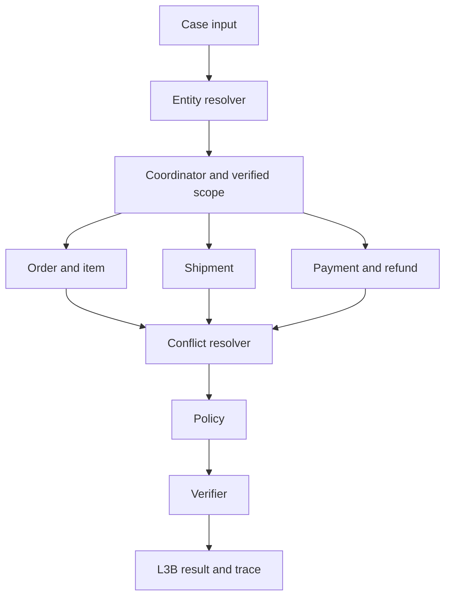

# L3B A2A architecture and public contracts

## Contract lock

The four public schemas and the shared L3A dependency are copied byte for byte into `contracts/schemas/`. The JSON Schema definitions control both required and optional fields; `additionalProperties: false` applies at the declared object levels. L3B references definitions from L3A, so deploy both files together. Select `day09-l3b-output-v2` and `day09-trace-event-v1` in the submission manifest; populate `case_set_version` and `generated_at` from the actual run. Do not add metadata to output, evidence envelopes, trace events, or manifest.

## Handoff and ownership

| Actor | Input | Ownership | Permitted MCP tools | Handoff |
| --- | --- | --- | --- | --- |
| `coordinator` | Case file | Route once, own the verified order scope | none | Scoped case to each specialist |
| `entity-agent` | Claimed and candidate identifiers, customer hint | Confirm exactly one order; reject every other candidate | `get_order`, `get_customer_history` | Verified `OrderScope` to coordinator |
| `order-agent` | Verified order | Item and seller membership, order value | `get_order_items`, `get_product_context` | Item facts with evidence refs |
| `shipment-agent` | Verified order | Compare promised, handed-over and delivered timestamps | `get_shipment_summary` | Timeline verdict with evidence refs |
| `payment-agent` | Verified order, order value | Reconcile captures, track the refund lifecycle | `get_payment_timeline`, `get_refund_timeline` | Monetary findings with evidence refs |
| `conflict-agent` | Contradictory sourced values | Name both sources and the precedence rule applied | none | `data_conflicts` entries |
| `policy-agent` | Scoped findings, `policy_version` | Read the published rule table, decide status, action and amount | `get_policy` | Supported recommendation |
| `verifier-agent` | Proposed L3B object, evidence ledger | Reconciliation, scope, ownership and chronology checks | none | Validated output or a rejection |

`solve_case(case, gateway, trace)` in `src/student_agent/workflow.py` runs this sequence. The runner in `cli.py` emits `case_received` before the call and `case_finalized` after it, so the workflow itself never duplicates those two events.

## MCP Evidence Gateway discipline

`EvidenceDesk` is the only door to the gateway, so all five gateway rules hold in one place:

1. **`case_id` on every call.** `EvidenceDesk.fetch` supplies it from the case under investigation; a specialist cannot omit or override it. The server refuses an identifier belonging to another case, which is the intended behaviour and is treated as "no evidence", never worked around.
2. **References are never synthesised.** `evidence_ref` is copied verbatim out of the envelope into `EvidenceLedger`. The ledger is created per `solve_case` call, so it cannot hold a reference from another case, and the output can only cite what the ledger holds.
3. **Only supporting evidence is cited.** Each tool answers a field the output actually carries. `get_order_payments` is skipped because `get_payment_timeline` returns the same payment rows plus the lifecycle events, and `get_sellers` is skipped because no output field depends on seller address data — `seller_id` already arrives with the items.
4. **`tool_result_consumed` after validation only.** The event is emitted once the envelope has passed `mcp-evidence-response-v1` in `EvidenceGateway.call` and the tool's declared domain matches `TOOL_DOMAINS`. A wrong-domain envelope is discarded with no event and no ledger entry.
5. **The client trace mirrors the server audit.** Every consumed envelope produces exactly one event naming the actor, the tool and the single reference, so the client sequence can be reconciled against the server's independent hash, latency and status audit.

Per case the run spends eight calls: `get_order`, `get_customer_history`, `get_order_items`, `get_product_context`, `get_shipment_summary`, `get_payment_timeline`, `get_refund_timeline`, `get_policy`. A tool-level refusal is a final answer and is not retried; only a timeout or transport fault gets a second attempt, capped at two per argument set. Requests are read only and idempotent.

## Entity resolution

A candidate identifier in the case file is a lead, not a fact. It becomes the scoped order only when `get_order` returns that exact `order_id` **and** the customer's own history lists it. Candidates that neither match the resolved order nor appear in the history are reported in `rejected_candidates`, and the verifier refuses any output that lets a rejected candidate reach `affected_entities`. No candidate is scored by a similarity heuristic: without calibrated scores an invented threshold would be guesswork.

## Source precedence

The gateway returns two revisions of the same `order_id`: the authoritative row from `get_order`, and a second row the customer history also carries, anchored on a different purchase timestamp. Every downstream row therefore has to be attributed before it can be used.

| Row | In scope when | Precedence rule |
| --- | --- | --- |
| Order | Returned by `get_order` | `AUTHORITATIVE_ORDER_ROW_PRECEDES_HISTORY` |
| Item, shipping limit | `shipping_limit_date` within 21 days after the authoritative purchase | `ITEM_SCOPED_TO_PURCHASE_WINDOW` |
| Capture, reconciliation event | Within 6 hours of the authoritative `order_approved_at` | `CAPTURE_SCOPED_TO_ORDER_APPROVED_AT` |
| Refund event | Repays one in-scope capture amount, within 45 days of the authoritative delivery | `CAPTURE_SCOPED_TO_ORDER_APPROVED_AT` |
| Shipment event | Within one day of the authoritative `delivered_customer_at` | `EVENT_OUTSIDE_AUTHORITATIVE_DELIVERY` |

Each rejected row is reported as a `data_conflicts` entry naming both sources and the rule that selected the winner. `selected_source` stays `null` only when no documented rule resolves the field.

When the two revisions share a purchase timestamp the windows above cannot separate them, and the payment window over-collects. That condition is detectable: one revision holds at most one payment per `payment_sequential`, so more in-window captures than the order has distinct sequentials means the attribution is ambiguous. The refund lifecycle is raised against the revision under investigation, so the amount it repays names the authoritative capture — `CAPTURE_SCOPED_BY_REFUND_LIFECYCLE`. Without a refund, the captures landing exactly on `order_approved_at` are preferred. If neither narrows the set, the conflict is reported with `selected_source: null` and `CAPTURE_REVISION_UNRESOLVED` rather than resolved by guesswork. Skipping this step would read a colliding pair of split payments as a duplicate charge and recommend the wrong refund.

`payment_references` lists only the sequentials whose `payment_value` matches a capture kept in scope, so the reported references, `captured_total_brl` and the refund lines all describe the same revision.

## Issue ranking

`classify` reads the scoped signals in a fixed order, and only an explicit signal counts:

1. `order_status == canceled` with a capture → `canceled_order_paid`
2. `order_status == unavailable` with a capture → `unavailable_order_paid`
3. An open `reconciliation_mismatch` event → `payment_mismatch`
4. A repeated in-scope capture whose total exceeds the order value → `duplicate_charge`
5. A `delivered_late` event on the authoritative delivery, by actor → `late_delivery_seller` or `late_delivery_logistics`
6. A failed, then a pending, in-scope refund → `refund_failed`, `refund_pending`
7. Several in-scope captures summing exactly to the order value → `valid_split_payment`
8. A complete timeline and ledger that support nothing → `unsupported_claim`
9. No resolved order or no scoped evidence → `insufficient_evidence`

A capture total that simply differs from the order value is never read as a mismatch: the gateway raises `reconciliation_mismatch` when the ledgers actually disagree, and inferring one from an amount gap would misclassify the freight-only and part-capture cases. The stated claim topic is never an input to this ranking; it is only compared against the result to judge each claim.

## Policy engine

`case_status`, `recommended_action`, `recommended_refund_brl` and `responsible_parties` all come from the `get_policy` rule matching the established issue. Business arbitration belongs to the policy the gateway serves; `contracts/scoring/scoring-policy-v2.json` is the scoring contract, and this workflow reads it for the lifecycle events the trace owes and the rule its confidence values are chosen against.

When no rule matches the established issue, the case stays `needs_investigation` with no refund line rather than receiving an invented amount, and a status of `action_required` with nothing to collect is downgraded for the same reason. Refund lines are reconciled against `recommended_refund_brl` with decimal arithmetic, and `resolution_actions` carries the policy's `recommended_action` de-duplicated. Unknown payment totals stay `null`; they are never reported as zero.

### Accountability

The published table states a party type, and `ACCOUNTABLE_PARTY` is what the verifier holds it against, so the liable party can never drift from the issue the evidence proved:

| Established issue | Answerable party |
| --- | --- |
| `canceled_order_paid` | `platform` |
| `unavailable_order_paid`, `late_delivery_seller` | `seller` |
| `late_delivery_logistics` | `logistics_provider` |
| `payment_mismatch`, `duplicate_charge`, `refund_failed`, `refund_pending` | `payment_provider` |
| `valid_split_payment`, `unsupported_claim` | `customer` |
| `insufficient_evidence` | `unknown` |

A seller delay therefore cannot leave the logistics provider paying, and vice versa. Where the party is a seller, the policy's template seller id is replaced by a seller this order actually has: citing the template would put an entity from outside this case's scope into the result.

## Confidence calibration

Calibration is graded as one minus the squared error between whether the primary issue is right and the confidence submitted, so `confidence` is a belief rather than a flourish. `calibrate` starts from how strong the decisive signal is — an authoritative `order_status`, an explicit `reconciliation_mismatch` or a `delivered_late` event with a named actor carries more than an amount equality, which carries more than the negative finding behind `unsupported_claim` — and then subtracts for every gap in the evidence behind it:

| Evidence condition | Effect |
| --- | --- |
| No policy rule applied | −0.20 |
| Capture revision unresolved | −0.25 |
| Capture revision ambiguous but resolved | −0.08 |
| Shipment or payment evidence unavailable | −0.10 |
| Incomplete timeline behind a delivery issue | −0.10 |
| Incomplete timeline otherwise | −0.03 |
| Order value unknown behind a split or duplicate finding | −0.15 |
| No confirmed item membership | −0.05 |
| No independent product confirmation | −0.03 |
| More than one revision of this order on record | −0.02 |
| The customer's own account corroborates the finding | +0.03 |

The result is capped at 0.97. It never reaches 1.0, because a second source disagreed somewhere in every case of this set, and `insufficient_evidence` is reported at 0.15 rather than dressed up.

## Failure and efficiency

| Failure | Budget | Result | Trace |
| --- | --- | --- | --- |
| MCP timeout or transport fault | 2 attempts, 30 s each, one 0.2 s pause | Mark that fact unavailable, continue | No `tool_result_consumed` |
| Tool-level refusal | 1 attempt, no retry | The gateway has no such evidence for this scope | No `tool_result_consumed` |
| Envelope fails the contract | No retry | Discarded by `EvidenceGateway.call` | No `tool_result_consumed` |
| Wrong evidence domain | No retry | Discarded, not registered in the ledger | No `tool_result_consumed` |
| Order missing or unverified | Exact lookup only | `entity_resolution.not_found`, `insufficient_evidence` | `verification_completed` |
| Policy rule absent | No retry | `needs_investigation`, no refund line | `policy_decided` |
| Verifier check fails | No retry without new evidence | `solve_case` raises; the runner writes no output | No `case_finalized` |

An exhausted argument set is remembered per case, so no key is retried later in the same investigation. Envelopes are cached only inside one case, references are never shared between cases, and no tool is called with anything but an exact identifier.

## Verification

The verifier runs with no gateway access, so it can only confirm what the specialists brought back. A contradictory case is worth less than an honest `needs_investigation`, so anything self-contradictory raises and the runner writes no output for it.

**Provenance.** Every reference cited in `evidence_refs` or in a `claim_assessments` entry is owned by this case's ledger; a substantive finding cites at least one; each conflict names two distinct sources and selects one it named, or `null`.

**Scope.** No rejected candidate reaches `affected_entities` or the resolved set; a resolved order is present and agrees with `entity_resolution`; an unresolved resolution names no order; an on-time verdict rests on a real delivery timestamp; late sellers are named only under a `seller_delay` verdict and only from this order's sellers.

**Cross-field consistency.** The established issue, the answerable party, both analyses and the ranked causes have to tell one story: the party matches `ACCOUNTABLE_PARTY`, a delivery issue matches the shipment verdict, a payment issue matches the payment verdict, the top ranked cause names the primary issue, ranks do not repeat, actions do not repeat, and `no_action` carries no refund.

**Money.** Refund lines reconcile with the recommended amount, a recommendation has a line to pay it on, `action_required` has something to collect, `refundable_total_brl` follows captured minus refunded, and a refund line names an entity inside this order. Where the policy's amount outruns the remaining refundable ledger, the verifier returns `POLICY_REFUND_EXCEEDS_REFUNDABLE_LEDGER` instead of rewriting the authoritative amount.

**Lifecycle.** Inside the investigation the verifier confirms the events it can see — `task_assigned` before `handoff`, a `policy_decided`, and a `tool_result_consumed` whenever the finding is substantive. `case_received`, `case_finalized` and the verifier's own event belong to the runner, so `day09 validate` checks the whole trace file against the scoring policy's `workflow_required_events`: each case opens with `case_received`, closes with `case_finalized`, carries each required event exactly once where it is a lifecycle bound, and verifies before it finalizes.

## Reproducibility

The implementation is deterministic: fixed sequential specialist order, no model call, no randomness, no wall-clock branch. `day09 validate` re-checks every output and trace event against the contracts, and `day09 package` validates the manifest against `submission-manifest-v2.schema.json`. Secrets stay in `.env`, outside outputs and trace; trace events carry references and observable decision codes only, never payload data or internal reasoning.
