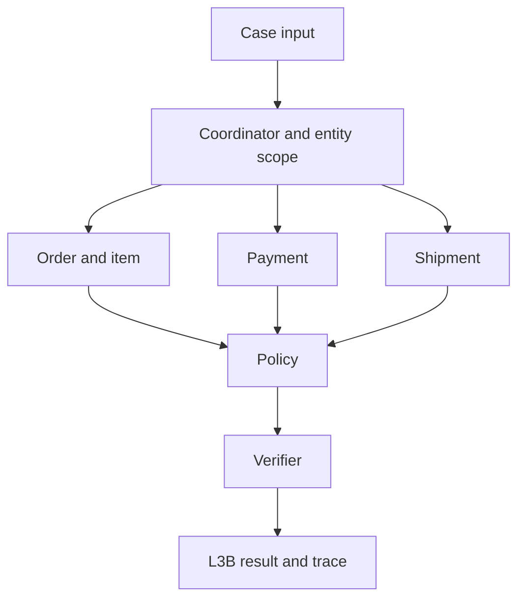

# L3B A2A architecture and public contracts

## Contract lock

The four public schemas and the shared L3A dependency are copied byte for byte into `contracts/schemas/`. The JSON Schema definitions control both required and optional fields; `additionalProperties: false` applies at the declared object levels. L3B references definitions from L3A, so deploy both files together. Select `day09-l3b-output-v2` and `day09-trace-event-v1` in the submission manifest; populate `case_set_version` and `generated_at` from the actual run. Do not add metadata to output, evidence envelopes, trace events, or manifest.

## Handoff and ownership

| Actor | Input | Ownership | Permitted MCP domains | Handoff |
| --- | --- | --- | --- | --- |
| Coordinator/entity resolver | Case ID and candidate identifiers | Route once; establish verified order scope; reject unlinked identifiers | `order` for exact candidate only | Scoped case to specialists |
| Order/item | Verified order and item candidate | Confirm order and item membership | `order`, `item`, `seller`, `product` | Order/item facts with evidence refs |
| Payment/refund | Verified order and payment candidate | Reconcile captures, refunds and remaining amount | `payment`, `refund` | Monetary findings with evidence refs |
| Shipment | Verified order and shipment candidate | Compare promised, shipped and delivered timestamps | `shipment` | Timeline verdict with evidence refs |
| Policy | Scoped facts and applicable policy ID | Decide eligibility, source precedence and action | `policy` | Supported recommendation |
| Conflict resolver | Contradictory sourced field values | Record sources and selected source or null | None | `data_conflicts` entries |
| Verifier | Proposed L3B object and evidence registry | Validate schema, scope, links, sums and claims | None | Validated output or safe investigation result |

The supplied `workflow.py` is an evidence-safe minimal implementation. It calls only exact input identifiers, verifies order membership using `data.order_id`, optionally retrieves a documented `policy_id`, and emits an investigation result. It does **not** implement broad candidate search, capture reconciliation, timeline verdicts, conflict resolution, or policy-based refund decisions: these require the actual gateway API and evidence payload definitions. Do not treat its conservative output as a full business-case solver.

## A2A message and evidence lifecycle

Internal handoffs carry `{case_id, target, scoped_order_id, evidence_refs, decision_code}`; these are internal messages, not additions to a public schema. Correlate strictly by `case_id`; keep the evidence registry local to a single invocation. An input identifier is a lead until confirmed by MCP. An envelope must pass the exact `mcp-evidence-response-v1` validator and domain check before its `evidence_ref` can be consumed. Only evidence whose payload explicitly matches the resolved order enters the final output. Trace `tool_result_consumed` only after successful validation. Store references, not raw personal/payment data, in trace. Never expose internal reasoning. A specialist may hand off to the coordinator once and the policy agent once; no recursive handoff.

For future candidate resolution, use exact identifiers and customer linkage first, reject candidates from different customers or orders, and mark ties ambiguous; do not invent a confidence threshold without calibrated scores. A conflicting field requires at least two named sources, a documented precedence rule and `selected_source=null` when unresolved. Link each substantive claim to same-case evidence. The current implementation does not synthesize claims or disputes from an incomplete envelope.

## Failure and efficiency

| Failure | Budget | Result | Trace |
| --- | --- | --- | --- |
| MCP timeout or connection error | 2 attempts, 8 seconds each, one 0.2-second pause | Mark that fact unavailable; continue with investigation | No `tool_result_consumed` for failed attempt |
| Invalid MCP envelope or wrong domain | No retry | Discard result | No consumed event |
| Order missing or unverified | Exact lookup only | `entity_resolution.not_found`, `needs_investigation` | `verification_completed` |
| Candidate ambiguity | Requires resolver implementation | Return ambiguous status, no speculative links | `verification_completed` |
| Source conflict | Requires resolver implementation | Do not select a winner without precedence | `policy_decided` if policy available |
| Invalid specialist result | No retry without new evidence | Verifier rejects before finalization | No `case_finalized` |

Cache verified envelopes only within one case. Limit each exact key to two calls. Do not scan entire tables or share evidence references between cases. The gateway adapter expected by this source is `gateway.call(domain, {'id': identifier})`; trace adapter is `trace.write(event)`. Connect these two interfaces to the actual starter kit before running. Gateway requests must be read only and idempotent.

## Verification and reproducibility

Validate the complete L3B schema with all L3A referenced definitions, including nested `additionalProperties`. Check case and entity scope, evidence registry ownership, claim references, chronology and source precedence whenever those findings are supplied. Reconcile refund lines with the recommended amount using decimal arithmetic; keep unknown payment totals as null, never as zero. Rejected candidates must not appear in `affected_entities`. Emit `verification_completed` before `case_finalized`.

Implementation uses Python asyncio with fixed sequential concurrency, at most two attempts per key, and no random model or prompt. Pin `jsonschema` to an approved compatible version in the host environment; the supplied files do not include a dependency lock or executable gateway/trace classes. Example host invocation: `await solve_case(case, gateway, trace)` after configuring the starter kit adapters. Keep secrets outside outputs and trace. Validate the final manifest against `submission-manifest-v2.schema.json` when packaging real case results.
